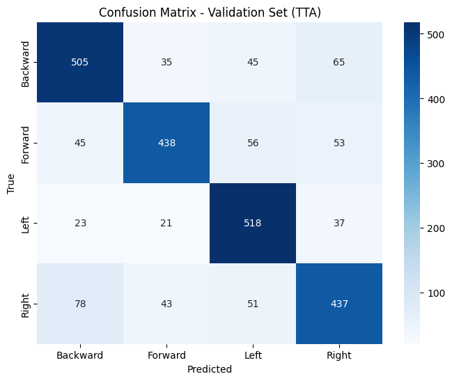
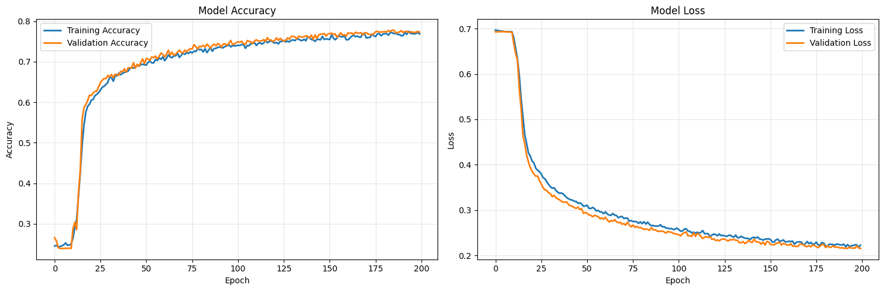
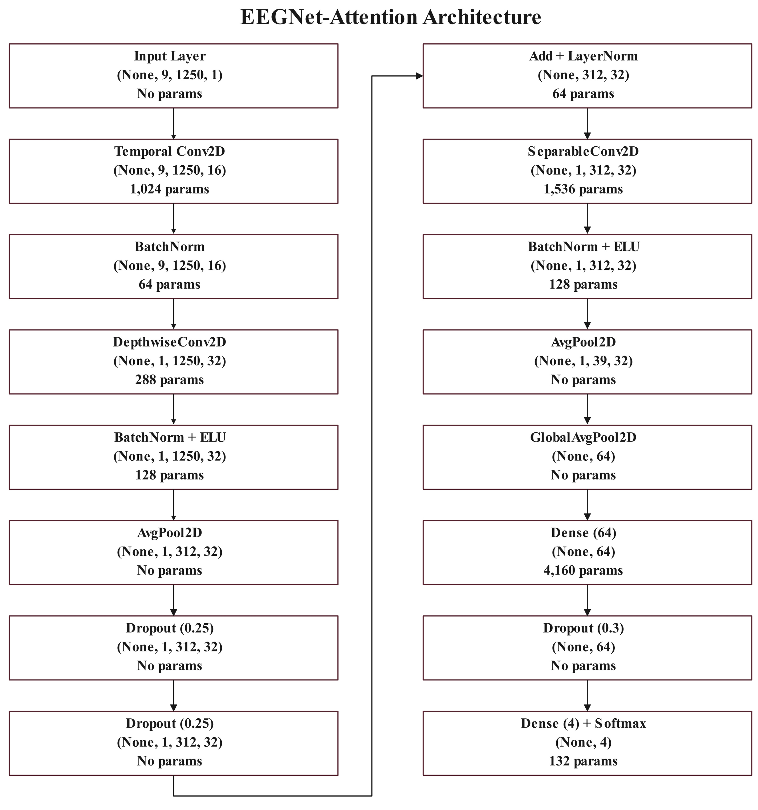

# MTC-AIC3 BCI Competition - SSVEP Classification System

Advanced Brain-Computer Interface system achieving **77.47% accuracy** on SSVEP classification using Enhanced EEGNet with Multi-Head Attention.

## 🏆 Competition Results

- **Validation Accuracy (TTA)**: 77.47%
- **Best Validation Accuracy**: 75.06% (during training)
- **F1-Scores**: All classes above 0.72, with Left class reaching 0.8164
- **Model Parameters**: 16,388 (highly efficient)
- **Data Augmentation**: 5x expansion (2,450 → 12,250 samples)

## 📊 Performance Visualization

### Confusion Matrix - Validation Set (TTA)


### Training History


### Model Architecture

## 🚀 Key Features

### Advanced Architecture
- **Enhanced EEGNet** with Multi-Head Attention mechanism
- Temporal and spatial filtering with depthwise separable convolutions  
- Global average pooling with dense regularization
- Attention blocks for capturing long-range dependencies

### State-of-the-Art Preprocessing
- 7-stage preprocessing pipeline
- Advanced artifact rejection using IQR and gradient-based methods
- Spatial filtering with Common Average Reference (CAR)
- Bipolar derivation (OZ-PZ) for enhanced SSVEP detection
- Robust normalization using median and MAD

### Innovative Training Techniques
- **SGDR** (Cosine Annealing with Warm Restarts) for optimal learning
- **Focal Loss** with class weighting for imbalanced data
- **Test Time Augmentation** (TTA) with temperature-scaled predictions
- Physiologically-aware data augmentation

## 📦 Installation

```bash
# Clone the repository
git clone https://github.com/Mahmoud-Zaafan/BCI-System.git
cd BCI-System

# Install dependencies
pip install -r requirements.txt
```

## 🔧 Usage

### Training

```bash
# Train with default configuration
python scripts/train.py

# Train with custom configuration
python scripts/train.py --config configs/ssvep_config.yaml
```

### Prediction

```bash
# Generate predictions on test data with TTA (recommended)
python scripts/predict.py --use_tta

# Without Test Time Augmentation
python scripts/predict.py
```

## 📈 Results

### Performance Metrics (Validation Set with TTA)
```
Classification Report:
              precision    recall  f1-score   support

    Backward     0.7757    0.7769    0.7763       650
     Forward     0.8156    0.7399    0.7759       592
        Left     0.7731    0.8648    0.8164       599
       Right     0.7382    0.7176    0.7277       609

    accuracy                         0.7747      2450
   macro avg     0.7757    0.7748    0.7741      2450
weighted avg     0.7754    0.7747    0.7739      2450
```

### Key Achievements
- **Consistent Performance**: All classes achieve F1-scores above 0.72
- **Best Class Performance**: Left direction with 0.8164 F1-score
- **Balanced Precision/Recall**: Minimal variance across classes
- **Efficient Architecture**: Only 16K parameters vs typical 100K+ models

### Training Convergence
- Smooth convergence without overfitting
- Validation accuracy closely tracks training accuracy
- SGDR scheduler enables exploration of multiple local minima
- Early stopping at epoch 150 with best weights restored

## 🗂️ Project Structure

```
bci-ssvep-system/
├── configs/                 # Configuration files
│   └── ssvep_config.yaml   # Main configuration
├── src/                    # Source code
│   ├── models/            # Neural network architectures
│   ├── augmentation/      # Data augmentation techniques  
│   ├── training/          # Training utilities
│   └── utils/             # Helper functions
├── scripts/               # Executable scripts
│   ├── train.py          # Training script
│   └── predict.py        # Prediction script
├── results/              # Results and visualizations
│   ├── confusion_matrix_tta.png
│   └── training_curves.png
└── notebooks/            # Jupyter notebooks
```

## 🔬 Technical Details

### Model Architecture
- **Input**: 8 EEG channels × 1250 time samples
- **Temporal Convolution**: 16 filters, kernel size 64
- **Depthwise Convolution**: Depth multiplier 2
- **Attention Mechanism**: 4 heads
- **Output**: 4-class softmax (Forward, Backward, Left, Right)

### Preprocessing Pipeline
1. DC offset removal
2. Bandpass filtering (1-40 Hz)
3. Notch filtering (50 Hz, 100 Hz)
4. Artifact rejection (IQR + gradient-based)
5. Spatial filtering (CAR)
6. Bipolar derivation
7. Robust normalization

### Data Augmentation Techniques
1. **Phase Perturbation**: ±50ms temporal shifts
2. **Amplitude Scaling**: 0.8-1.2x range
3. **Frequency Masking**: Random band suppression
4. **Random Phase Erasing**: FFT-domain augmentation

## 📈 Future Improvements

- [ ] Implement ensemble methods combining multiple architectures
- [ ] Add cross-subject transfer learning
- [ ] Integrate real-time processing capabilities
- [ ] Expand to hybrid MI-SSVEP classification
- [ ] Implement adaptive filtering based on SNR

## 📝 Citation

If you use this code in your research, please cite:

```bibtex
@software{bci_ssvep_2025,
  title={Enhanced EEGNet with Attention for SSVEP Classification},
  author={Mahmoud Zaafan},
  year={2025},
  url={https://github.com/Mahmoud-Zaafan/BCI-System}
}
```

## 📄 License

This project is licensed under the MIT License - see the LICENSE file for details.

## 🙏 Acknowledgments

- MTC-AIC3 Competition organizers
- EEGNet authors (Lawhern et al., 2018)
- TensorFlow and scikit-learn communities